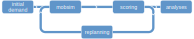

<!-- !!! info "MATSim 13.0 released"

    [MATSim 13.0](news/2021-04-12-matsim-13-released/) now available, and brings a number of improvements. Read the [announcement](news/2021-04-12-matsim-13-released/)!
-->

Welcome to MATSim

MATSim is an open-source framework for implementing large-scale agent-based transport simulations.  **Learn more...**

<video class="hero-video" autoplay muted loop playsinline width=800 height=300>
  <source src="images/hero-video.m4v" type="video/mp4">
</video>

